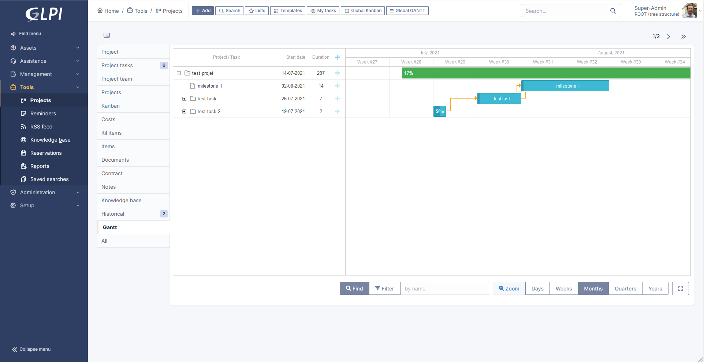
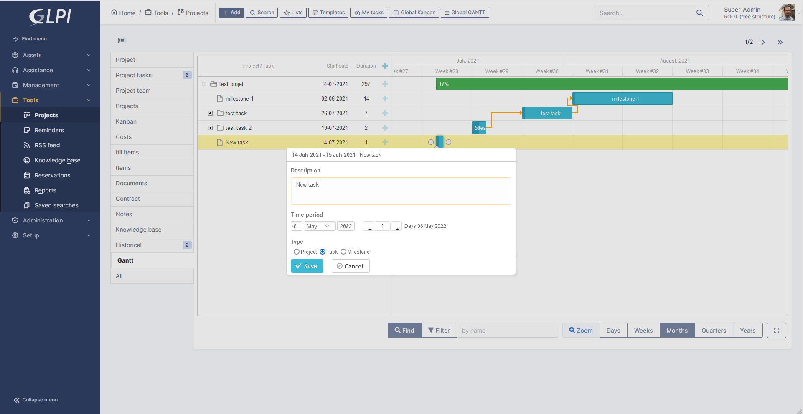

# GLPI Gantt plugin

This GLPI plugin add Gantt view to GLPI projects.
The feature was removed from core from 10.0.1 version due to license incompatibility.
## Contributing

* Open a ticket for each bug/feature so it can be discussed
* Follow [development guidelines](http://glpi-developer-documentation.readthedocs.io/en/latest/plugins/index.html)
* Refer to [GitFlow](http://git-flow.readthedocs.io/) process for branching
* Work on a new branch on your own fork
* Open a PR that will be reviewed by a developer

## Screenshots

